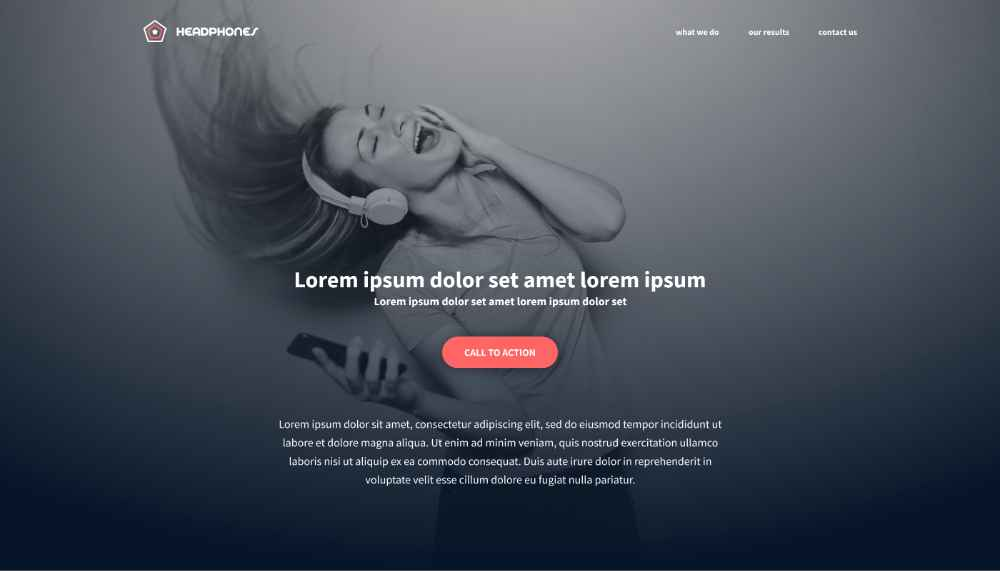

# Headphones Website

## Description

Welcome to the Headphones Website project! This simple website showcases an elegant design for an online headphones store. Built with only HTML and CSS, it's a perfect learning resource for front-end web development beginners.

## Features

- **Home:** Attractive hero multi-section with informations to other pages and call-to-action.
- **our results:** Testimonials of our customers says about us.
- **what we do:** Brief story about the brand and its mission.
- **contact us:** Simple contact form for users to get in touch.

## Installation

1. Clone the repository: `git clone https://github.com/RicCodeX/headphones.git`
2. Navigate to the project directory: `cd headphones`
3. Open the `index.html` file in your web browser.

## License

This project is licensed under the MIT License - see the [LICENSE](LICENSE) file for details.

## Contact

For questions or suggestions, contact the project maintainer at mrar0220@gmail.com.

---

**Note:** This website is for educational purposes only. Product information is fictional, and the focus is on HTML and CSS skills; it does not include backend functionality for product purchases.
